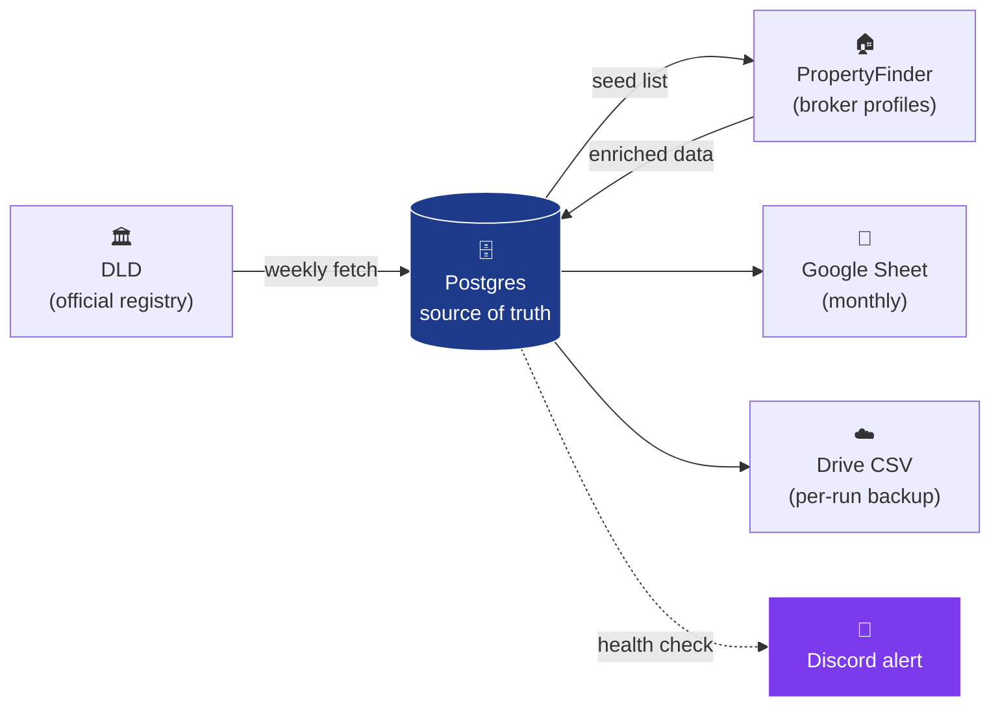
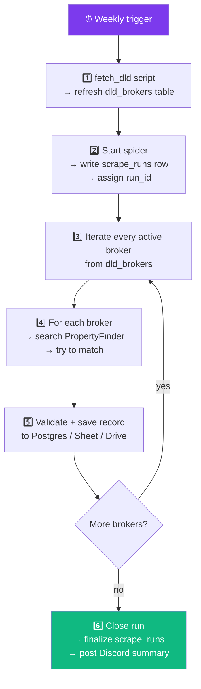
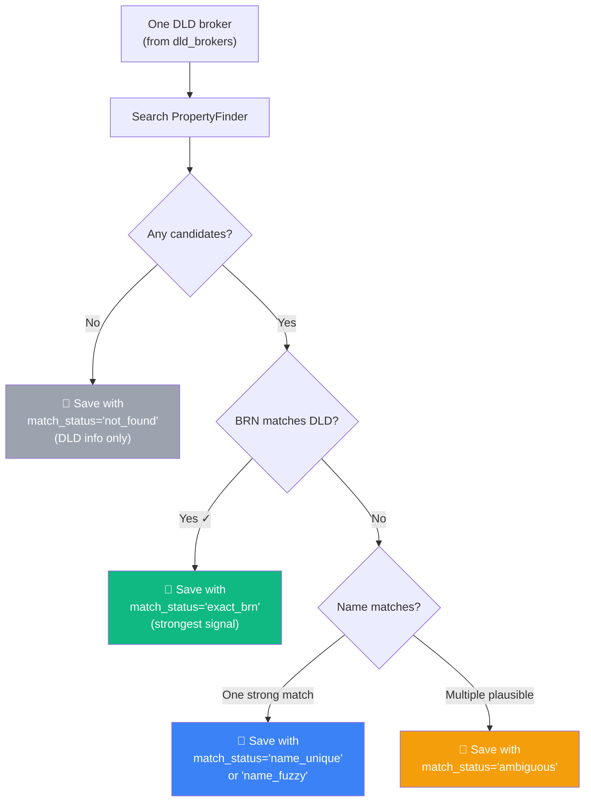
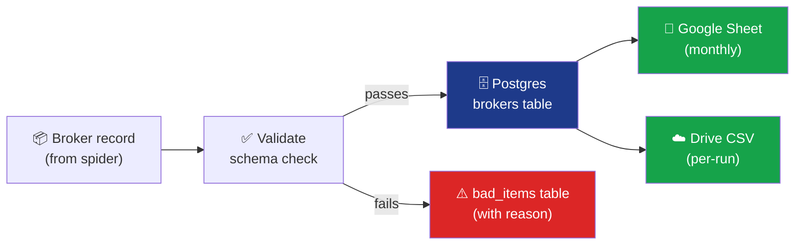
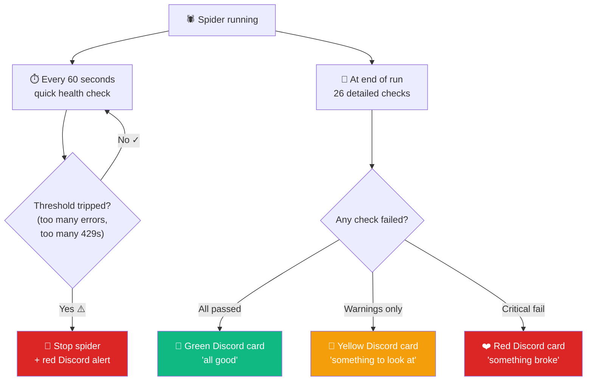

# How the system works — end-to-end walkthrough

A walkthrough of what happens from the moment we trigger the system to the moment you can browse the results in a Google Sheet. Table names are mentioned in `code style` so you have reference points if you ever want to look something up.

---

## The big picture in one paragraph

We pull the official list of licensed brokers from DLD (Dubai Land Department), then for each broker we search PropertyFinder, find their profile, and pull everything PropertyFinder publishes about them — listings, closed deals, agency info, performance numbers. All of this is stored in our own database, written into a Google Sheet you can browse, and archived as a CSV in Google Drive. While it's running, the system watches itself for problems and pings you on Discord if anything looks off.

---

## Step by step — what happens on a normal week

The weekly flow at a glance:

### Step 1 — Refresh the DLD broker list

We run a small script: `python -m broker_scout.tools.fetch_dld`.

It calls DLD's official API, downloads the current list of every licensed broker in Dubai, and saves them into the `dld_brokers` table. If a broker was already there, we update their details (agency might have changed, expiry date might have moved, etc.). New brokers get inserted.

Each broker has their **BRN** (Broker Registration Number) — DLD's unique ID for them. This is the most important piece of identification we have.

We do this **weekly**, usually before kicking off the spider. The DLD list moves slowly so a fresh fetch once a week is plenty.

### Step 2 — Kick off the spider

We run: `poetry run scrapy crawl agent_spider`.

Before doing anything else, the system stamps the run with a unique ID (a random string like `f917b3...`) and writes a row into the `scrape_runs` table to record that a run has started. From this point on, every log line, every broker we save, and every alert is tagged with that run ID — so we can always trace exactly what happened in any given run.

### Step 3 — The spider picks up where DLD left off

The spider opens the `dld_brokers` table and goes through every active broker, one by one. For each broker, it asks PropertyFinder: "do you have a profile for this person?"

Three things can happen:

1. **Exact match** — PropertyFinder returns a profile with the same BRN as DLD has. This is the gold standard; we know we've got the right person.
2. **Name match** — PropertyFinder doesn't expose the BRN on the listing, so we match by name (handling typos, word order, initials). If exactly one candidate matches strongly enough, we go with it.
3. **No match** — PropertyFinder doesn't have a profile for this broker (a lot of DLD-licensed brokers aren't on PF, which is normal).

In all three cases, **we save a row** for that broker. Even the "no match" case gets a row with a status of `not_found` so we have a complete record — it's never silently skipped.

Whatever happens, **one DLD broker = one record saved.** Nothing is lost.

### Step 4 — Pull the broker's full profile

When we find a match, we fetch the broker's PropertyFinder profile page and extract:

- Identity: name, nationality, specialization, years of experience, WhatsApp response time
- Their agency (which we then visit separately to grab the agency licence number)
- Active listings: how many for sale, how many for rent, average price, average age, most recent listing date
- Closed deals: how many they've completed, total value, monthly average

Listings are paginated, so the spider may fetch many pages per high-volume broker. The system handles that automatically.

### Step 5 — Save the result everywhere

Once the broker's record is complete, it flows through three storage layers in order:

Each layer has a specific job:

1. **Validation** — the record is checked for completeness and sanity (no negative prices, no impossibly-old dates, required fields present, etc.). Anything that fails the check goes into the `bad_items` table with the exact reason, so we never lose track of what was rejected.
2. **Postgres** — the record lands in the `brokers` table. This is our **source of truth**. Every field is stored, plus a copy of the original raw data so we can always go back and see exactly what was on PropertyFinder when we scraped it.
3. **Google Sheets** — the same record is appended to the active monthly spreadsheet. The system creates a fresh spreadsheet at the start of every month automatically (so May data lives in one sheet, June in another, etc.), and tracks which is currently active in the `sheet_registry` table.
4. **Google Drive CSV** — every spider run produces one CSV file containing every record from that run. The CSV is uploaded to a Drive folder you control. Useful for back-up and for replaying a run if needed.

### Step 6 — The spider closes cleanly

When the spider finishes (either because it processed every DLD broker or hit a stopping condition), it:

- Updates the `scrape_runs` row with the final status (`ok` or `failed`), the count of brokers scraped, and a snapshot of every metric the run produced.
- Drains any remaining validation failures into `bad_items`.
- Flushes any rows still buffered to Sheets.
- Uploads the CSV to Drive.
- Sends a summary card to Discord (covered in the next section).

---

## How we know if something broke

The system runs **26 separate health checks** on every spider run. They split into two groups by *when* they run.

### Group 1 — Live checks during the run (every 60 seconds)

These are the safety brakes. If they trip, the spider is **stopped immediately** so we don't waste time or burn through quotas while something is broken.

| Check | What it watches | What "fail" means |
|---|---|---|
| **Error count** | Total number of error log lines so far | The spider is hitting too many problems to keep going. |
| **Rate-limit watch** | How many "slow down" responses (429s) PropertyFinder has sent | We're being throttled — better to pause and investigate than get our IP banned. |

When either one trips, two things happen at once:
- The spider closes itself cleanly.
- A **red "Circuit breaker tripped" card** is posted to Discord with the live counters so you know exactly what tripped.

### Group 2 — End-of-run checks (after the spider finishes)

These run once, after every storage layer has flushed its final batch. They're more thorough — looking at the *quality* and *completeness* of the run, not just whether it survived.

#### Did the run actually do its job?

| Check | meaning |
|---|---|
| **Finish reason looks healthy** | Did the spider stop on its own, or was it killed / cancelled mid-way? |
| **At least some brokers were processed** | If we got zero items, the spider probably crashed before doing any work — loud failure so it doesn't go unnoticed. |
| **Retry rate isn't too high** | If we had to retry too many requests, the network or proxies are flaky and the data may be incomplete. |
| **Specific HTTP errors stayed in budget** | A few 403s or 503s are normal; lots of them aren't. |

#### Did the data we extracted look right?

| Check | meaning |
|---|---|
| **Overall validation rate** | Of all the records we tried to save, how many failed our schema check? |
| **No single field is failing too often** | If 90% of records have the same field rejected, PropertyFinder almost certainly changed that field's format. |
| **Profile pages still parse** | If the embedded data on PF profile pages stopped loading, we're probably looking at a site redesign. |
| **Search results still parse** | Same idea, for the search-results page. |
| **Listings API still returns valid JSON** | The endpoint that returns each broker's listings hasn't changed shape. |
| **BRN extraction works on most profiles** | We can pull the broker's licence number from most pages. |
| **Agency licence numbers are still extractable** | The agency-page selector still works. |

#### Did matching work the way we expect?

| Check | meaning |
|---|---|
| **High-confidence match rate** | A healthy chunk of brokers (60%+) match by either BRN or exact name — the strongest signals. |
| **Not-found rate is reasonable** | Some "not found" is normal (not every DLD broker is on PF), but if 50%+ come back missing, the search step is probably broken. |
| **Ambiguous rate is low** | Most brokers should resolve to one clear candidate. Lots of ambiguous cases means PF stopped exposing BRN in their search results. |
| **PF and DLD agree on BRNs** | If PropertyFinder shows a different BRN than DLD has for the same broker, we flag it — could be a recent re-licensing, could be a data error worth checking. |

#### Did we save everything we said we'd save?

| Check | meaning |
|---|---|
| **Postgres got every record** | The database row count matches the spider's count. |
| **Google Sheet got every record** | Sheets row count matches too. |
| **No Sheets flush errors** | The final Sheets push didn't hit any failures. |
| **Drive CSV uploaded successfully** | The per-run CSV made it to Drive. |
| **CSV row count matches the run** | The CSV has every record the spider produced. |

#### Are the important fields actually populated?

The system buckets every field into three tiers — Critical, High, Medium — based on how important it is. After the run, it checks **only the brokers we matched** (so empty `not_found` stubs don't drag the average down).

| Check | Threshold | Meaning |
|---|---|---|
| **Critical fields populated** | 95%+ | Things like broker name, agent URL, BRN. If any of these drops, something is seriously broken. |
| **High-priority fields populated** | 80%+ | Listing counts, closed-deal counts. Things you'd want for any analysis. |
| **Medium-priority fields populated** | 50%+ | Things like average prices and agency URLs. Nice to have, occasional gaps OK. |

Each tier shows you exactly which fields fell below the bar — so a "high-priority" failure might tell you "average_listing_price_sale dropped to 30%", and you know exactly where to look.

### The two kinds of alerts you'll see in Discord

**1. Mid-run "Circuit breaker tripped" alert** (rare, only when something is going wrong live)

- Triggered by a Group 1 check.
- The spider has already been stopped by the time you see this.
- Card shows: which check tripped, current error count, how many items had been scraped so far, the run ID for cross-reference.

**2. End-of-run summary card** (every run, no exceptions)

- Posted as soon as the spider closes cleanly.
- Card shows: run timestamp + ID, total items scraped, validation pass rate, match-status breakdown (how many exact matches, name matches, not-found, etc.), storage layer ✓/✗ marks (Postgres, Sheets, Drive), finish reason, runtime, and links to the live Sheet + Drive CSV.
- Colour reflects the worst result:
  - 💚 **Green** — every check passed. Nothing to do.
  - 💛 **Yellow** — one or more "warning-level" checks failed. Worth a quick look but not urgent.
  - ❤️ **Red** — at least one critical check failed. The card lists which ones, with the reason. Look soon.

Even a passing run posts a green card on purpose — it's the "all clear" signal so you don't have to wonder whether the spider ran at all.

### How alert spam is avoided

Every alert that gets sent is also written to the `alert_log` table. Before sending the same critical alert twice, the system checks — if the same alert was sent in the last 30 minutes, it skips. So if a problem persists across multiple periodic checks, you get one alert, not a flood.

---

## How to look at the data

| Want to see… | Look here |
|---|---|
| The current month's brokers (browse-friendly) | The active Google Sheet for the platform |
| Last month's brokers | Same Drive folder, previous month's spreadsheet |
| The full canonical record for a broker | `brokers` table in Postgres |
| The DLD broker list | `dld_brokers` table |
| Every spider run + its outcome | `scrape_runs` table |
| Validation failures (records we rejected) | `bad_items` table |
| Every Discord alert we've sent | `alert_log` table |
| Which spreadsheet is active per platform | `sheet_registry` table |
| A specific run's full log | `logs/<spider>_<run_id>.log` (kept for 30 days) |
| A specific run's raw CSV | `out/<spider>_<run_id>.csv` (locally, also in Drive) |

---

## How often we plan to run things

| Job | Cadence | Why |
|---|---|---|
| DLD ingest (`fetch_dld`) | Weekly | DLD list changes slowly; weekly is plenty fresh |
| PropertyFinder spider | Weekly | One spider run after each DLD ingest |
| Bayut spider | Weekly (when built) | Same cadence, separate spider |
| Monthly Sheet rotation | Automatic | Pipeline copies the template into a fresh spreadsheet on the first run of each month |
| Old log cleanup | Automatic | Files older than 30 days are pruned at the start of each run |
| Old CSV cleanup | Manual / cron | Operator deletes from `out/` when needed |

The full operator workflow ends up looking something like:

> Once a week — kick off `fetch_dld`, then start the spider. Watch for the green Discord card 30–40 minutes later. If it's red, open the card, see which monitor failed, and look at the relevant table or log file. That's the whole loop.

---

## In short

DLD list → spider visits each broker on PropertyFinder → matched record gets validated → saved to Postgres + Google Sheets + Drive CSV → monitors check the run end-to-end → Discord card tells you if anything looked wrong.

Repeatable, auditable (every row knows which run produced it), and forgiving (a problem in one storage layer doesn't take the others down).

---

## A glossary, just in case

- **DLD** — Dubai Land Department, the official regulator for real-estate brokers.
- **BRN** — Broker Registration Number, DLD's unique ID per broker.
- **PropertyFinder / Bayut** — the two big real-estate listing platforms in Dubai.
- **Spider** — the program that visits PropertyFinder for each broker.
- **Run** — one execution of the spider, start to finish.
- **Monitor** — an automatic check that runs against a spider's stats.
- **Postgres** — our database.
- **Source of truth** — the place where the canonical version of the data lives. For us, that's Postgres. The Sheet and Drive CSV are convenient views on top.
